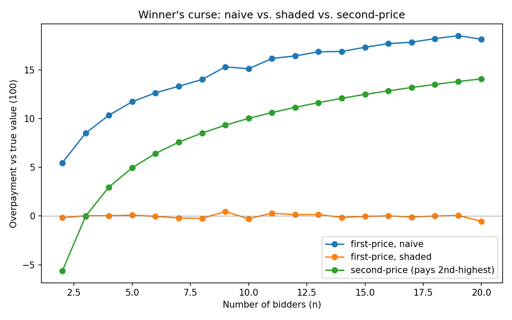

# Auctions and the Winner's Curse

**Question:** in a common-value auction, everyone has a noisy estimate of
what something is worth. The winner is whoever guessed highest — and is
therefore probably wrong. How large is that bias, does a payment-rule
change (second-price) fix it on its own, and can bidders correct for it by
shading their bids?

## Setup

- Common-value item, true value `V = 100`
- `N` bidders (swept 2 to 20), each observing `V + Normal(0, σ=10)` noise
- Three conditions compared: first-price naive, first-price shaded
  (correcting for `E[max of N draws]`), and second-price (pays the
  second-highest bid)

## Results



First-price naive overpayment climbs steadily with `n` (more bidders means
a higher expected maximum). Shading by the derived correction `c(n)` flattens
this to ~0 regardless of `n`. Second-price sits in between: substantially
better than naive without any strategic shading, because the payment is
based on the second-highest draw rather than the winner's own — but it
still rises with `n`, since even the second-highest of a larger crowd trends
upward.

Full numeric sweep: `output/auction_results.csv`. Derivation of the shading
correction and the first-price/second-price distinction: `DERIVATION.md`.

## What surprised me

Second-price auctions reduce the winner's curse automatically, just from
changing what the winner pays — without any bidder needing to reason about
shading at all. But it doesn't eliminate the curse the way explicit shading
does under first-price: the correction is structural but partial, not
complete.

## Files

- `src/auction_sim.cpp` — simulation (shading estimation, first-price and
  second-price sweeps)
- `DERIVATION.md` — shading correction derivation, first-price vs.
  second-price analysis
- `output/auction_results.csv` — full numeric results, n = 2 to 20
- `output/auction_comparison.png` — comparison chart

## Reproduce

```bash
g++ -O2 -std=c++17 src/auction_sim.cpp -o auction_sim
./auction_sim              # writes output/auction_results.csv
python3 plot.py            # generates output/auction_comparison.png
```
