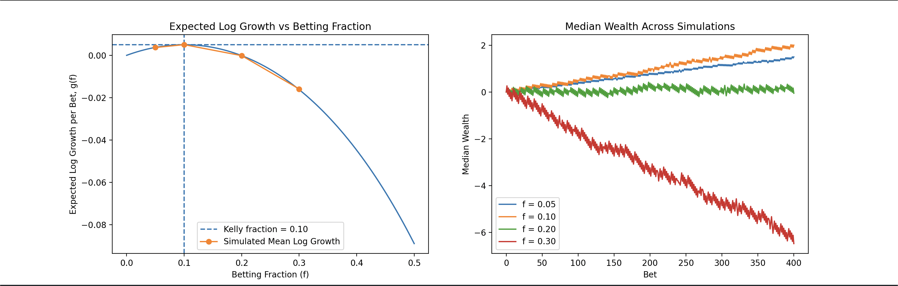

# Kelly Criterion — Bet Sizing Simulation

**Question:** given a repeated bet with a real edge, how much of your bankroll
should you risk each time? Sizing it wrong can turn a winning bet into a loser
— even at 2x the optimal size, a genuinely profitable bet stops growing your
bankroll at all.

## Setup

- Repeated even-money bet, win probability `p = 0.55`
- Four sizing rules: fixed 5%, full Kelly (10%), 2x Kelly (20%), 3x Kelly (30%)
- 400 independent simulated bankrolls per rule, 600 bets each
- Kelly fraction derived on paper first (`DERIVATION.md`), then confirmed
  against the simulated mean log-growth rate at each tested fraction

## Results

| Strategy | f | Simulated mean log-growth/bet | Final median log-wealth (bet 400) |
|---|---|---|---|
| Fixed | 0.05 | +0.003696 | 1.452 |
| Full Kelly | 0.10 | +0.005043 (peak) | 1.908 |
| 2x Kelly | 0.20 | -0.000148 (~2nd root) | 0.168 |
| 3x Kelly | 0.30 | -0.015889 | -6.125 |

Full numeric sweep: `output/kelly_results.csv` (or equivalent output file).

## What the chart shows



*Left:* the analytic expected log-growth curve `g(f)`, with the simulated
mean log-growth rate plotted at each of the four tested fractions — the
simulated points sit almost exactly on the analytic curve, confirming the
derivation. The curve peaks at the derived Kelly fraction `f* = p − q = 0.10`
and crosses back to zero at `2f* = 0.20`.

*Right:* median **cumulative log-wealth** (not raw wealth) across 400
simulated bankrolls per strategy, bet-by-bet over 400 bets. Full Kelly
compounds fastest; fixed 5% is steadier but slower; 2x Kelly is flat despite
a real edge; 3x Kelly is ruinous, ending at a median log-wealth of -6.125
(equivalent to roughly 0.2% of starting capital remaining) — this is the
counterintuitive part: **the edge never changed, only the sizing did.**

## What surprised me

Betting *more* than Kelly doesn't just grow slower — past `2f*` it actively
loses money in the long run, even though every individual bet still has
positive expected value. Expected-value-per-bet and long-run growth rate are
different objectives, and this is exactly where they diverge.

## Files

- `src/kelly_sim.cpp` — simulation (bankroll paths + growth-rate comparison)
- `DERIVATION.md` — paper derivation of the Kelly fraction, the simulated
  results table, and the edge-misestimation sensitivity analysis
- `output/kelly_comparison.png` — the two-panel results chart

## Reproduce

```bash
g++ -O2 -std=c++17 src/kelly_sim.cpp -o kelly_sim
./kelly_sim                 # runs simulation, writes results
python3 plot.py             # generates output/kelly_comparison.png
```
