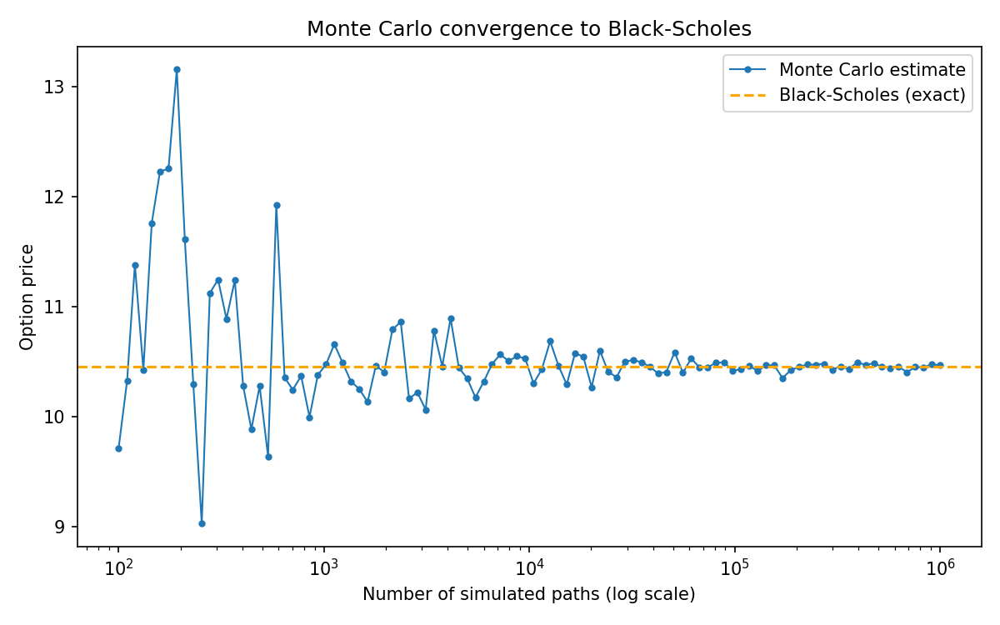

# Monte Carlo Option Pricer

**Question:** how many simulated price paths does it take for a Monte Carlo
option price to converge to the true theoretical value — and does it
actually converge to the right place?

## Setup

- European call option, `S_0=100, K=100, r=5%, σ=20%, T=1yr` (standard
  textbook parameters)
- Monte Carlo: simulate terminal stock price via Geometric Brownian Motion,
  average the discounted payoff across trials
- Validation: closed-form Black-Scholes price, computed independently via
  the standard normal CDF (`erf`-based)
- Swept 100 log-spaced trial counts from 100 to 1,000,000

## Results



Black-Scholes gives an exact price of **10.4506**, matching the standard
textbook reference value for these parameters. The Monte Carlo estimate
swings widely below ~1,000 trials (from 9.02 up to 13.16 — well over ±10%
from the true value), then tightens into a band within ~0.3% of the exact
value beyond ~100,000 trials. The dense 100-point sweep makes the funnel
shape of the convergence clearly visible.

Full numeric sweep: `output/convergence.csv`. Full derivation (GBM,
Black-Scholes formula, discounting): `DERIVATION.md`.

## What surprised me

The convergence isn't smooth or monotonic — it overshoots in both
directions before settling, which is a direct visualization of `1/√trials`
Monte Carlo error: cutting the error in half requires *quadrupling* the
trial count, not just doubling it.

## Files

- `src/option_pricer.cpp` — Black-Scholes closed-form + Monte Carlo
  simulator + convergence sweep
- `DERIVATION.md` — GBM setup, Black-Scholes formula, results table
- `output/convergence.csv` — full 25-point sweep
- `output/convergence.png` — convergence chart
- `plot.py` — generates the chart from the CSV

## Reproduce

```bash
g++ -O2 -std=c++17 src/option_pricer.cpp -o option_pricer
./option_pricer            # writes output/convergence.csv
python3 plot.py            # generates output/convergence.png
```
